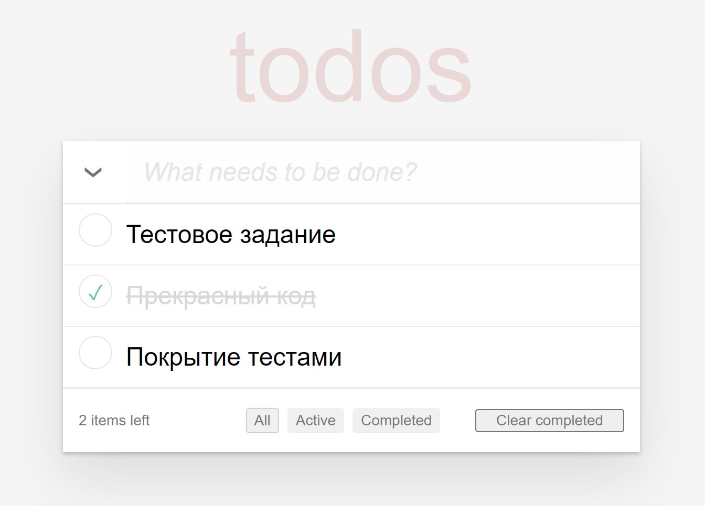
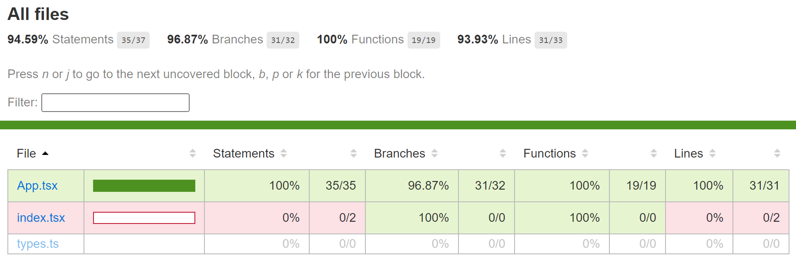

# mindbox-todo

ToDo-приложение, позволяющее управлять текущим списком дел

## Что есть в интерфейсе:

- Поле для ввода новой задачи
- Списки всех задач, невыполненных и выполненных задач (по-отдельности)

## Внешний вид приложения

## Соблюденные требования к коду:

- Приложение создано с использованием TypeScript, React и React Hooks
- Библиотеки компонент – на ваше усмотрение
- Ключевая на ваш взгляд функциональность обязательно покрыта тестами
- Проект должен запускаться командой npm i && npm run start
- Проект доступен на GitHub Pages/Vercel/etc

## Тесты проверяют:

- Добавление задачи через Enter и кнопку сохранения
- Переключение состояния задачи
- Фильтрацию задач (All, Active, Completed)
- Сворачивание/разворачивание списка задач
- Очистку завершенных задач

## Отчет о покрытии кода тестами:

